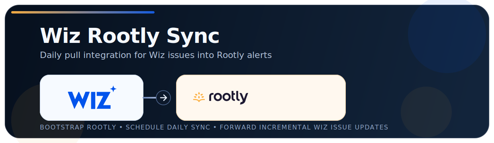

<p align="center">
  
</p>

# Wiz Rootly Sync

`wiz_to_rootly.py` runs a WIN-style daily pull from Wiz GraphQL and forwards Wiz issues to a Rootly webhook.

Default query path follows the WIN issues pull guidance, prefers `issuesV2`, requires `read:issues`, and falls back through compatibility query shapes when tenants expose different fields.

## Quickstart

For most users, the easiest setup is:

1. Copy `.env.wiz-rootly.example` to `.env.wiz-rootly`.
2. Add `WIZ_CLIENT_ID` and `WIZ_CLIENT_SECRET`.
3. Run `python3 wiz_to_rootly.py bootstrap-rootly --rootly-api-token <rootly-api-token> --write-env`.
4. Run `python3 wiz_to_rootly.py validate`.
5. Run `python3 wiz_to_rootly.py sync --dry-run`.
6. Run `python3 wiz_to_rootly.py sync`.
7. Schedule `python3 wiz_to_rootly.py sync` once per day.

That is the recommended onboarding flow for customers, demos, and WIN submission.

## What This Bridge Does

This bridge is responsible for ingestion and lifecycle sync:

- It authenticates to Wiz and pulls issues over the Wiz API.
- It transforms Wiz issues into Rootly alert payloads.
- It sends those payloads to a Rootly Generic Webhook source.
- It keeps alert lifecycle state aligned by sending new/opened items and later sending resolved/closed updates for the same `dedupe_key`.
- After the first successful sync, it switches to delta pulls using the last successful run timestamp.

This bridge does not decide who gets paged, who owns the alert, or whether an incident is declared. Those actions are configured inside Rootly after the alert arrives.

This is a WIN-style pull integration. The intended runtime model is a scheduled `python3 wiz_to_rootly.py sync` execution no more frequently than daily.

In practice, the flow is:

1. The bridge sends a Wiz alert into Rootly.
2. Rootly stores it as an alert under your Generic Webhook source.
3. Rootly routes, escalates, pages, and creates incidents based on Rootly alert routes and workflows.

## 1) Configure The Bridge

Copy the example env file and fill in values:

```bash
cp .env.wiz-rootly.example .env.wiz-rootly
```

The script auto-loads `.env.wiz-rootly` from the repo root, so you do not need to `source` it manually.

You can also point to a different file:

```bash
python3 wiz_to_rootly.py --env-file /path/to/custom.env validate
```

Minimum required values before Rootly bootstrap:

- `WIZ_CLIENT_ID`
- `WIZ_CLIENT_SECRET`

## 2) Bootstrap Rootly Alert Source (Recommended)

Use the bootstrap command to create or update the Rootly Generic Webhook source and write the webhook values into `.env.wiz-rootly`:

```bash
python3 wiz_to_rootly.py bootstrap-rootly --rootly-api-token <rootly-api-token> --write-env
```

This is the recommended Rootly setup path because it:

- creates or updates the Generic Webhook source
- configures title/description mappings when Rootly fields are available
- configures dedupe using `dedupe_key`
- configures auto-resolution using `resolved`
- writes `ROOTLY_WEBHOOK_URL` and `ROOTLY_ALERT_SOURCE_ID` into `.env.wiz-rootly`

Current bridge field behavior:

- `title` is built from Wiz control/title and now appends resource + short issue ID.
  - Example: `Secrets not stored in a secret container (Private Key) [feea4f03]`
- `description` is either `Wiz reported a <TYPE> item with <SEVERITY> severity.` or `Wiz marked a <TYPE> item as <STATUS>.`
- `urgency` maps from Wiz severity (for example, `HIGH` -> `High`).
- `dedupe_key` is a stable unique identifier for the Wiz issue.
- `resolved` becomes `true` when Wiz reports a terminal status such as `RESOLVED` or `CLOSED`.

Important:

- These mappings apply to newly created alerts after saving.
- Older alerts may still display the old title.
- Configure Rootly dedupe using the payload's `dedupe_key`.
- Configure Rootly auto-resolution so events with `resolved=true` resolve the alert with the same unique identifier.

Useful bootstrap options:

```bash
python3 wiz_to_rootly.py bootstrap-rootly --dry-run
python3 wiz_to_rootly.py bootstrap-rootly --rootly-api-token <rootly-api-token> --write-env
python3 wiz_to_rootly.py bootstrap-rootly --rootly-alert-source-name "Wiz Findings"
python3 wiz_to_rootly.py bootstrap-rootly --rootly-alert-source-id src_123
```

## 3) Validate Setup

Before making any Wiz or Rootly calls, validate the local config:

```bash
python3 wiz_to_rootly.py validate
```

This checks the required env vars, confirms whether webhook auth is present, validates JSON env settings, and tells you the next command to run. If `ROOTLY_WEBHOOK_URL` is still missing, the validation output recommends the bootstrap command.

## 4) Dry Run

This prints the payloads instead of calling Rootly:

```bash
python3 wiz_to_rootly.py sync --dry-run
```

Dry-run does not mutate `.wiz_rootly_seen_ids.json`, so your first live run can still forward the same issues.

## 5) Live Run

Single cycle:

```bash
python3 wiz_to_rootly.py sync
```

Single cycle (default, no command needed):

```bash
python3 wiz_to_rootly.py
```

Continuous poller:

```bash
python3 wiz_to_rootly.py run
```

## 6) Production Scheduling (Recommended)

For most customers, the correct production model is a scheduled `sync` run (not a long-running poller). This aligns with Wiz API pull guidance to monitor no more frequently than daily.

- Recommended cadence: once per day
- Keep `WIZ_STATE_FILE` persistent so dedupe works across runs
- Use continuous mode only if you need near-real-time forwarding

Example cron (daily at 9:00 AM):

```bash
0 9 * * * cd /path/to/Rootly-Wiz-Bridge && python3 wiz_to_rootly.py sync >> wiz_rootly.log 2>&1
```

## 7) Route Alerts in Rootly

Paging and incident-routing logic lives in Rootly, not in this bridge. After alerts are ingesting correctly, add a rule in `Alerts -> Routes` or an `Alert Workflow` to decide which Wiz alerts should page responders, notify a team, or create incidents.

Example rule:

- Condition: `Urgency is High` (Rootly requires at least one condition)
- Route to: your user, team, or escalation policy

## 8) Manual Rootly UI Setup (Fallback)

If you do not want to use the bootstrap command, you can create or open the Generic Webhook source in Rootly manually.

Navigation path in Rootly:

- `Alerts` (left panel) -> `Sources` -> `+ New Source` -> `Generic Webhook`

Use one of these forms from Rootly setup:

- URL with secret query param:
  - `https://webhooks.rootly.com/webhooks/incoming/generic_webhooks?secret=...`
- URL + Authorization header:
  - URL: `https://webhooks.rootly.com/webhooks/incoming/generic_webhooks`
  - Header: `Authorization: Bearer <secret>`

Set the corresponding values in `.env.wiz-rootly`:

- `ROOTLY_WEBHOOK_URL`
- Optional: `ROOTLY_WEBHOOK_AUTH_HEADER` + `ROOTLY_WEBHOOK_AUTH_VALUE`

## Notes

- Dedupe and lifecycle state is stored in `.wiz_rootly_seen_ids.json`.
- Default poll interval is daily (`POLL_INTERVAL_SECS=86400`) to align with WIN API pull best practice.
- Default order is newest-updated-first:
  - `WIZ_ORDER_BY_JSON='{"field":"UPDATED_AT","direction":"DESC"}'`
- Default pull filtering uses delta updates after the first successful run:
  - first run with no successful-run timestamp: `{"status":["OPEN","IN_PROGRESS"]}`
  - later runs: `{"statusChangedAt":{"after":"<last_successful_run_at>"}}`
  - legacy state files without run metadata continue using status filtering until the next successful run writes the delta cursor
- Keyword filtering is optional:
  - `WIZ_MATCH_KEYWORDS=vulnerability,threat,cve,detection`
- If you want to narrow the Wiz query itself, you can still provide:
  - `WIZ_FILTER_BY_JSON='{"status":["OPEN","IN_PROGRESS","RESOLVED","CLOSED","REJECTED"]}'`
  - When `WIZ_FILTER_BY_JSON` is set, the bridge still adds `statusChangedAt.after` automatically after the first successful run unless you already set `statusChangedAt` yourself.
- If your Wiz tenant uses a different query shape, set either:
  - `WIZ_GRAPHQL_QUERY`
  - `WIZ_GRAPHQL_QUERY_FILE`
- Rootly bootstrap environment variables:
  - `ROOTLY_API_TOKEN`
  - `ROOTLY_API_URL=https://api.rootly.com`
  - `ROOTLY_ALERT_SOURCE_NAME=Wiz Security Alerts`
  - `ROOTLY_ALERT_SOURCE_ID=<optional-existing-id>`
  - `ROOTLY_OWNER_GROUP_IDS=grp_123,grp_456`
- Optional severity filtering: `WIZ_ONLY_SEVERITIES=critical,high`.
- When `WIZ_ONLY_SEVERITIES` is set, those severities are added to the Wiz GraphQL filter as well as the local forwarding filter.
- Terminal statuses that resolve alerts default to `resolved,closed,rejected` and are configurable:
  - `WIZ_RESOLVED_STATUSES=resolved,closed,rejected`
- On first sight, already-resolved issues are stored in local state but not forwarded. This avoids backfilling historical closures into Rootly.
- `sync` is the recommended one-shot command.
- `--once` still works as a backward-compatible alias for `sync`.
- Rootly delivery defaults are tuned to avoid webhook rate limits:
  - `ROOTLY_MAX_RPS=1`
  - `ROOTLY_MAX_RETRIES=5`
  - `ROOTLY_RETRY_BASE_SECS=1.0`
  - `ROOTLY_RETRY_MAX_SECS=30.0`
- If Rootly still returns `429`, lower `ROOTLY_MAX_RPS` or temporarily reduce the first live run with `WIZ_ONLY_SEVERITIES` and/or `WIZ_PAGE_SIZE`.
- Wiz rate-limit controls:
  - `WIZ_MAX_RPS=2`
  - `WIZ_MAX_RETRIES=5`
  - `WIZ_TOKEN_REFRESH_RETRIES=5`
  - `WIZ_RETRY_BASE_SECS=1.0`
  - `WIZ_RETRY_MAX_SECS=30.0`
  - Script retries throttles (`429`) and transient `5xx` errors with backoff.
  - Script refreshes token and retries when token expiration/invalid auth is detected.
  - Script surfaces GraphQL `UNAUTHORIZED` errors with scope guidance.
  - Script handles HTTP 200 + GraphQL partial-data responses by continuing with available nodes.
