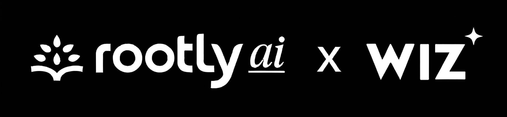

<p align="center">
  
</p>

# Wiz Rootly Sync

`wiz_to_rootly.py` pulls Wiz issues into Rootly and keeps the same alert updated through open and resolved states. It follows the WIN pull model: first run uses an Issues Report for the full sync, and later runs switch to `issuesV2` delta pulls after the first successful sync.

## Quickstart

1. Copy `.env.wiz-rootly.example` to `.env.wiz-rootly`.
2. Add `WIZ_CLIENT_ID` and `WIZ_CLIENT_SECRET`.
3. Set `ROOTLY_API_TOKEN` in your environment or secret manager, then run `python3 wiz_to_rootly.py bootstrap-rootly --write-env`.

## Verify

```bash
python3 wiz_to_rootly.py validate
python3 wiz_to_rootly.py sync --dry-run
```

## Go Live

```bash
python3 wiz_to_rootly.py sync
```

## Production

Schedule `python3 wiz_to_rootly.py sync` once per day.

`bootstrap-rootly` is the default setup path. It uses `ROOTLY_API_TOKEN` from your environment to create or update the Rootly Generic Webhook source, configures dedupe and auto-resolution, and writes the webhook settings into `.env.wiz-rootly`.

If you do not want to use `bootstrap-rootly`, you can create the Generic Webhook source directly in Rootly and copy the webhook values into `.env.wiz-rootly` yourself. In that manual setup path, `ROOTLY_API_TOKEN` is not required.

`.env.wiz-rootly` is auto-loaded from the repo root, so you do not need to `source` it manually.

## Commands

### Bootstrap Rootly

```bash
python3 wiz_to_rootly.py bootstrap-rootly --write-env
```

Set `ROOTLY_API_TOKEN` in your environment before running this command.

Optional flags:

- `--dry-run` previews the Rootly setup without changing anything.
- `--rootly-alert-source-name <source-name>` targets a source name.
- `--rootly-alert-source-id <source-id>` targets an existing source directly.

### Validate

```bash
python3 wiz_to_rootly.py validate
```

Checks that the local config is ready and tells you the next command to run.

### Sync

```bash
python3 wiz_to_rootly.py sync --dry-run
python3 wiz_to_rootly.py sync
```

`sync --dry-run` prints the Rootly webhook payloads generated from Wiz issues without sending them.
`sync` sends those payloads live to Rootly.

On the first successful live run, `sync` uses a Wiz Issues Report for the full sync. Later runs use the direct Issues API with `statusChangedAt.after=<last_successful_run_at>`.

`python3 wiz_to_rootly.py` defaults to `sync`.
`python3 wiz_to_rootly.py run` starts the continuous poller.
`--once` still works as a compatibility alias for `sync`.

## Scheduling

Run `sync` once per day for production:

```bash
0 9 * * * cd /path/to/wiz-rootly-sync && python3 wiz_to_rootly.py sync >> wiz_rootly.log 2>&1
```

## Rootly Routing

This sync delivers alerts into Rootly. Routing, paging, and incident creation stay in Rootly:

- `Alerts -> Routes`
- `Alert Workflows`

## Manual Rootly Setup

You do not need `bootstrap-rootly` if you prefer to create the Rootly Generic Webhook source yourself in the Rootly UI. In that case, copy the webhook details from Rootly into `.env.wiz-rootly` and run the sync normally.

Set:

- `ROOTLY_WEBHOOK_URL`
- optional `ROOTLY_WEBHOOK_AUTH_HEADER`
- optional `ROOTLY_WEBHOOK_AUTH_VALUE`

`ROOTLY_API_TOKEN` is only needed for the bootstrap path. It is not required for normal sync runs or for manual webhook setup.

## Troubleshooting

- `validate` fails on Wiz credentials: confirm `WIZ_CLIENT_ID`, `WIZ_CLIENT_SECRET`, `WIZ_USER_AGENT`, and that the service account has `read:issues`, `read:threat_issues`, `create:reports`, and `read:reports`.
- Wiz report creation fails on the first run: confirm the report scopes above and that `WIZ_API_URL` points at the correct tenant data center.
- Rootly webhook returns `429`: rerun `sync`; the integration retries throttled webhook requests and deduplicates alerts on retry.
- Nothing appears in Rootly: run `python3 wiz_to_rootly.py sync --dry-run` first, then confirm the alert source exists and the webhook settings in `.env.wiz-rootly` match the Rootly source.
- Too many alerts on first live run: narrow the sync with `WIZ_ONLY_SEVERITIES=critical,high` before the first production run.

## Notes

- Sync state is stored in `.wiz_rootly_seen_ids.json`.
- First successful live run uses a full Issues Report filtered by the current initial-sync status filter; later runs use `statusChangedAt.after=<last_successful_run_at>`.
- `WIZ_ONLY_SEVERITIES=critical,high` narrows the query and forwarded alerts.
- `WIZ_FULL_SYNC_STRATEGY=report` keeps the first run on the Reports API. Set `WIZ_FULL_SYNC_STRATEGY=api` only if you explicitly need to skip the report path.
- `WIZ_RESOLVED_STATUSES=resolved,closed,rejected` controls which Wiz statuses resolve Rootly alerts.
- On first sight, already-resolved issues are stored locally but not forwarded.
- `WIZ_ORDER_BY_JSON` is optional; leave it unset unless you specifically need a custom Wiz sort order.
- `WIZ_USER_AGENT` identifies the integration to Wiz and should follow the `partner-name-version` format.
- Use `--env-file /path/to/custom.env` if you want a different env file.
